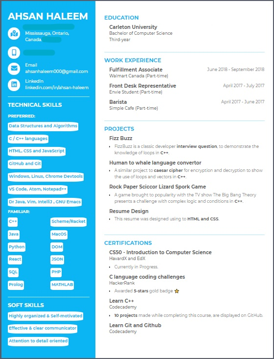

# Hi there 👋

- 🔭 I’m currently working on my C/C++ projects and web development (HTML, CSS and JavaScript) projects.  
- 🌱 I’m currently learning C, C++ and JavaScript to accomplish intermediate knowledge.   
&nbsp;&nbsp;&nbsp;&nbsp;&nbsp;&nbsp;However I have knowledege in Python, Java, Scheme, Prolog, SQL, SQL server, Databases, Data Structure and Algorithms, Object-oriented programming and willing to learn anything new quickly.
- 😄 Passions: Creating something new & impactful and helping others.
- 💬 Ask me about anything!
- 👯 I’m looking to collaborate on anything!
- 📫 How to reach me:  
&nbsp;&nbsp;&nbsp;&nbsp;&nbsp;&nbsp;School email: ahsanhaleem@cmail.carleton.ca (connected to this GitHub account)  
&nbsp;&nbsp;&nbsp;&nbsp;&nbsp;&nbsp;Primary email: ahsanhaleem999@gmail.com  
&nbsp;&nbsp;&nbsp;&nbsp;&nbsp;&nbsp;LinkedIn: https://ca.linkedin.com/in/ahsan-haleem  

### My Resume
&nbsp;&nbsp;Please take a look at my resume!  
&nbsp;&nbsp;You can simply access my resume by clicking my name on top of "Hi there 👋" or accessing README of this repository.

